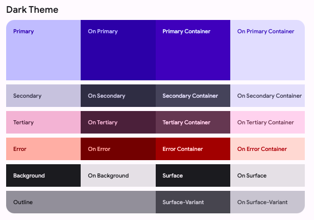

# Metaverse Musings

A responsive blog website about the Metaverse, drawing inspiration from Google's Material Design 3.

## Live Website

### https://pietersmith81.github.io/metaverse-musings

## Tech Stack

HTML, CSS Grid, Flexbox, and media queries.

## Overview

This is my first project in the Udacity front-end web developer course. This project is all about HTML (HyperText Markup Language) and CSS (Cascading Style Sheets). We were tasked with creating a personal blog website, and I have chosen the topic of "the Metaverse" for my blog.

From a design point of view, I based my blog website's design loosely on Google's [Material Design 3](https://m3.material.io/) design system. Both the [top app bar](https://m3.material.io/components/top-app-bar/overview) and the [navigation drawer](https://m3.material.io/components/navigation-drawer/overview) are based on Google's designs for these components.

From a development point of view, the entire website was developed using the [Visual Studio Code](https://code.visualstudio.com/) code editor. The website's responsive design was tested using Google Chrome DevTools' [Device Mode](https://developer.chrome.com/docs/devtools/device-mode/). This should help to ensure that the site displays correctly on various devices of different sizes, including mobile phones, tablets, and computer monitors. Finally, I tried to adhere to the [Udacity Frontend Nanodegree Style Guide](https://udacity.github.io/frontend-nanodegree-styleguide/index.html) when writing my HTML and CSS code.

## Usage

- Click the live website link at the top of this readme to open an online version of the Metaverse Musings blog website.
- Alternatively, clone or download this GitHub repository to your local computer and then open the `index.html` file to view the website (there's no need to install any dependencies since this is a vanilla HTML and CSS website).

## Navigation

Only the following links and features work on this website:

- **The website title (i.e. "Metaverse Musings")** - clicking this will always return you to the home page.
- **The "About" icon in the top app bar** - clicking this will take you to the "About the author" page containing my bio.
- **The "Dark mode" icon in the top app bar** - switches between light and dark mode (more on this below).
- **The first blog post card on the home page (named "What is the Metaverse?")** - takes you to an example blog post.
- **The "Design system" link on the navigation menu on the home page** - takes you to this page.
- **All links on this page** - take you to the websites of the various design components that were used to create this website.

**All other links and features are dummy items and are for demonstration purposes only.** Clicking them won't do anything apart from taking you to the top of the current page.

## Color palette and cards

For my color palette, I again turned to Google's Material Design 3. I used their [Dynamic Material Theme Builder](https://material-foundation.github.io/material-theme-builder/#/dynamic) along with a background image from Shutterstock (the cool virtual reality girl at the top of this page) to obtain a primary palette color. This primary color was #454dd2. A nice "blue-purplish" color (the color of all the links on this page).

I then used my #454dd2 primary color on Google's [Custom Material Theme Builder](https://material-foundation.github.io/material-theme-builder/#/custom), which provided me with an entire color palette to use for my blog website. There is an "EXPORT" button in the top right-hand corner of the Material Theme Builder, which allows you to export your color palette to a CSS file. And that is where I obtained the colors I used for the light and dark themes for my website (see the theme-light.css and theme-dark.css files for all colors generated by Google's Material Theme Builder). I also used the example _Plant Care_ app in the Material Theme Builder for inspiration for the blog post cards on my home page.

Below are screenshots of my light and dark themes from Google's Material Theme Builder, as well as a screenshot of the example _Plant Care_ app:

#### Light theme from Google's Material Theme Builder

#### Dark theme from Google's Material Theme Builder

#### Example app from Google's Material Theme Builder

## Light and dark mode

Using the light and dark themes above, I was able to add a button to the top app bar of all my pages to dynamically swap between light and dark mode. I'm particularly proud of this feature. I will aim to improve on this feature once I've learned JavaScript and how to use cookies. That way, I will be able to persist the user's light/dark mode choice across the various pages of my website.

Give this feature a bash by scrolling to the top of this page. Then click the _moon_ icon in the top right-hand corner of the page to switch to _dark mode_. You can then click the _sun_ icon to switch back to _light mode_.

## Typography

I used [Google Fonts](https://fonts.google.com/) for all my font needs. [Roboto](https://fonts.google.com/specimen/Roboto) was used for all HTML body and element text, while [Orbitron](https://fonts.google.com/specimen/Orbitron) was used for all titles.

## Icons and images

I then used Google Fonts' [Icons](https://fonts.google.com/icons) for all my icon needs. I could have used Google's icon font directly by linking to their CSS style sheet in the <head> section of my HTML pages (similar to what I did to link to the Roboto and Orbitron Google fonts). However, using their icon font directly would limit me to only using Google's icons in the future. So, I rather downloaded the icons I needed and coloured them using the CSS _filter_ property.

More details on how these icons (and most other images on this site) were filled with custom colors can be found at the following links:

- [Stackoverflow Question 22252472 - How to change the color of a svg element using CSS](https://stackoverflow.com/questions/22252472/how-to-change-the-color-of-an-svg-element) (see the top "To change any SVGs color" answer by Manish Menaria).
- [Codepen CSS filter generator](https://codepen.io/sosuke/pen/Pjoqqp) (use the "Target color" field to create a CSS filter using a hex color value).

## Browser compatibility

This website was tested and should work fine with the following web browsers:

- Chrome
- Brave Browser
- Firefox
- Safari
- Microsoft Edge
- Chrome Android
- Brave Browser Android

**Internet Explorer is not supported since it is a legacy browser and is not compatible with many new CSS rules.**

## Final thoughts

I thoroughly enjoyed my first project in the Udacity front-end web developer course. There was a lot of "feature creep" in my designs, and I will need to keep things simple in the coming projects to not overrun on time. But despite taking a long time to develop my blog website and all its features, I have truly learned a lot in doing so.

I feel a bit like Neo in The Matrix. But instead of knowing "Kung Fu"...

